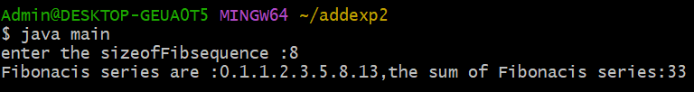
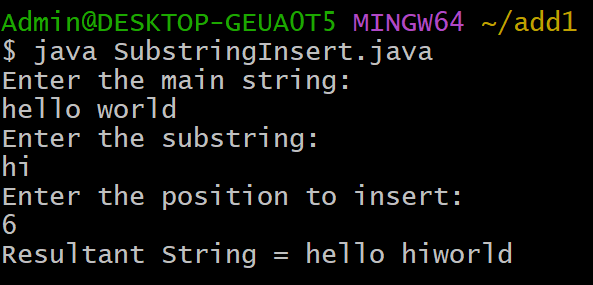
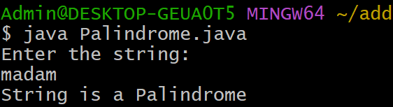
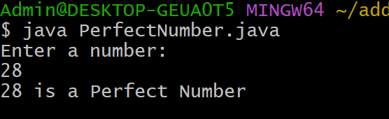

#  ADDITIONAL EXPERIMENT-2:
## 2) Title: Sum of the fist n Fibonacci numbers
## Source Code:
```java
class Fibonacis {
    int firstNumber;
    int secondNumber;
    int thirdNumber;
    int sum;
    int sizeofFibsequence;
    Fibonacis(int size) {
    firstNumber =0;
    secondNumber =1;
    thirdNumber =0;
    sum =0;
    sizeofFibsequence=size;
   }
    void generateFibsequence() {
      while(sizeofFibsequence>0) {
       if(sizeofFibsequence>1)
    System.out.print(firstNumber +".");
    else
    System.out.print(firstNumber +",");
    sizeofFibsequence--;
    sum+=firstNumber;
    thirdNumber=firstNumber+secondNumber;
    firstNumber=secondNumber;
    secondNumber=thirdNumber;
   }
  }
    int getFibsum() {
      if(sum>0)
      return sum;
    else {
      generateFibsequence();
       return sum;
   }
  }
}
import java.util.Scanner;
  class main {
   public static void main(String args[]) {
  System.out.print("enter the sizeofFibsequence :");
    Scanner sc=new Scanner(System.in);
    int size =sc .nextInt();
       if(size>0) {
    Fibonacis Fib =new Fibonacis(size);
  System.out.print("Fibonacis series are :");
     Fib.generateFibsequence();
  System.out.println("the sum of Fibonacis series:"+ Fib.getFibsum());
 }
  else
  System.out.println("Fibonacis sequence and sum can not be calculate");
 }
}
```
## output:

  
    
#  ADDITIONAL EXPERIMENT-1:
## 1) Title: Java Program to Insert a Substring
## Source Code:
```java
import java.util.Scanner;

class SubstringInsert {
    public static void main(String args[]) {

        String mainString, subString;
        int position;

        Scanner sc = new Scanner(System.in);

        System.out.println("Enter the main string:");
        mainString = sc.nextLine();

        System.out.println("Enter the substring:");
        subString = sc.nextLine();

        System.out.println("Enter the position to insert:");
        position = sc.nextInt();

        if (position >= 0 && position <= mainString.length()) {

            String firstPart = mainString.substring(0, position);
            String secondPart = mainString.substring(position);

            String result = firstPart + subString + secondPart;

            System.out.println("Resultant String = " + result);
        } else {
            System.out.println("Substring insertion not possible.");
            System.out.println("Position should be between 0 and " + mainString.length());
        }

        sc.close();
    }
}
```
## output:


#  ADDITIONAL EXPERIMENT-3:
## 3) Title: Java Program to Check Palindrome
## Source Code:
```java
import java.util.Scanner;

class Palindrome {
    public static void main(String args[]) {

        String str;
        Scanner sc = new Scanner(System.in);

        System.out.println("Enter the string:");
        str = sc.nextLine();

        int start = 0;
        int end = str.length() - 1;
        boolean flag = true;

        while (start < end) {
            if (str.charAt(start) != str.charAt(end)) {
                flag = false;
                break;
            }
            start++;
            end--;
        }

        if (flag)
            System.out.println("String is a Palindrome");
        else
            System.out.println("String is not a Palindrome");

        sc.close();
    }
}
```
## output:


#  ADDITIONAL EXPERIMENT-4:
## 4) Title: Java Program to Check Perfect Number
## Source Code:
```java
import java.util.Scanner;

class PerfectNumber {
    public static void main(String args[]) {

        Scanner sc = new Scanner(System.in);

        System.out.println("Enter a number:");
        int num = sc.nextInt();

        int sum = 0;

        for (int i = 1; i < num; i++) {
            if (num % i == 0) {
                sum = sum + i;
            }
        }

        if (sum == num)
            System.out.println(num + " is a Perfect Number");
        else
            System.out.println(num + " is not a Perfect Number");

        sc.close();
    }
}
```
## output:

  
    
