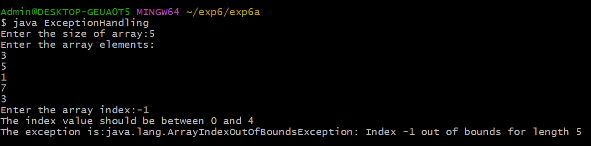
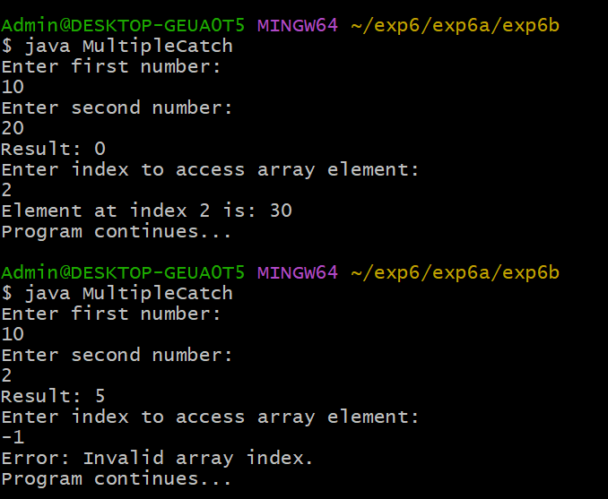
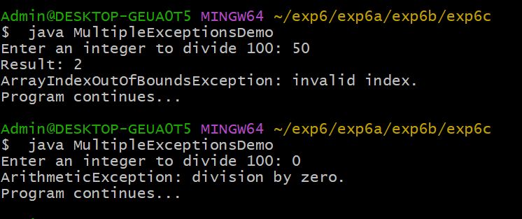

# EXPERIMENT-6
## 3a) Title:EXCEPTION HANDLING MECHANISM
## Source Code:
```java
import java.util.Scanner;
class ExceptionHandling{
public static void main(String[]args){
Scanner sc=new Scanner(System.in);
System.out.print("Enter the size of array:");
int size=sc.nextInt();
int[]arr=new int[size];
System.out.println("Enter the array elements:");
for(int i=0;i<size;i++){
arr[i]=sc.nextInt();
}
System.out.print("Enter the array index:");
int index=sc.nextInt();
try{
System.out.println("The value at array index is:"+arr[index]);
}
catch(ArrayIndexOutOfBoundsException e){
System.out.println("The index value should be between 0 and "+(size-1));
System.out.println("The exception is:"+e);
}
sc.close();
}
}
```
## Output:


## 6b) Title: ILLUSTARTING MULTIPLE CATCH CLAUSES
## Source Code:
```java
import java.util.Scanner;
import java.util.InputMismatchException;

class MultipleCatch {
    public static void main(String[] args) {

        Scanner sc = new Scanner(System.in);
        int[] arr = {10, 20, 30};

        try {
            System.out.println("Enter first number:");
            int a = sc.nextInt();

            System.out.println("Enter second number:");
            int b = sc.nextInt();

            int result = a / b;
            System.out.println("Result: " + result);

            System.out.println("Enter index to access array element:");
            int index = sc.nextInt();

            System.out.println("Element at index " + index + " is: " + arr[index]);
        }
        catch (ArithmeticException e) {
            System.out.println("Error: Division by zero is not allowed.");
        }
        catch (InputMismatchException e) {
            System.out.println("Error: Please enter numeric values only.");
        }
        catch (ArrayIndexOutOfBoundsException e) {
            System.out.println("Error: Invalid array index.");
        }

        System.out.println("Program continues...");
        sc.close();
    }
}
```
## Output:


## 6c) Title: creation of java built-in exception scenario
## Source Code:
```java
import java.util.Scanner;

public class MultipleExceptionsDemo {
    public static void main(String[] args) {

        Scanner sc = new Scanner(System.in);

        try {
            // ArithmeticException
            System.out.print("Enter an integer to divide 100: ");
            int n = sc.nextInt();
            int result = 100 / n;
            System.out.println("Result: " + result);

            // ArrayIndexOutOfBoundsException
            int[] arr = new int[3];
            System.out.println("Accessing element: " + arr[5]);

            // NumberFormatException
            System.out.print("Enter a number as text: ");
            sc.nextLine(); // clear buffer
            String s = sc.nextLine();
            int num = Integer.parseInt(s);
            System.out.println("Converted number: " + num);
        }
        catch (ArithmeticException e) {
            System.out.println("ArithmeticException: division by zero.");
        }
        catch (ArrayIndexOutOfBoundsException e) {
            System.out.println("ArrayIndexOutOfBoundsException: invalid index.");
        }
        catch (NumberFormatException e) {
            System.out.println("NumberFormatException: invalid numeric format.");
        }
        catch (Exception e) {
            System.out.println("Some other exception occurred.");
        }

        System.out.println("Program continues...");
        sc.close();
    }
}
```
## Output:

