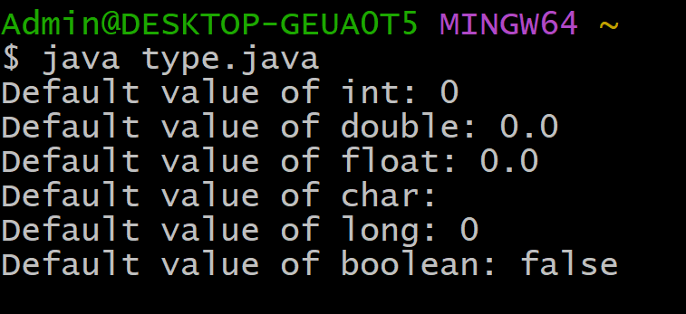

# EXPERIMENT-1:
## 1a) Title: Displaying Default Primitive Types
## Source Code:
```java
class DisplayDefaultPrimitiveType {
  int printInt;
  double printDouble;
  float printFloat;
  char printChar;
  long printLong;
  boolean printBoolean;
  public static void main(String[] args) {
    DisplayDefaultPrimitiveType dpt = new DisplayDefaultPrimitiveType();
    System.out.println("Default value of int: " + dpt.printInt);
    System.out.println("Default value of double: " + dpt.printDouble);
    System.out.println("Default value of float: " + dpt.printFloat);
    System.out.println("Default value of char: " + dpt.printChar);
    System.out.println("Default value of long: " + dpt.printLong);
    System.out.println("Default value of boolean: " + dpt.printBoolean);
  }
}
```
## Output:

