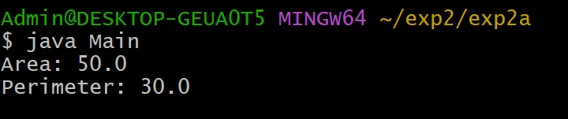

# EXPERIMENT-2
## 2a) Title: Find Area and Perimeter of a Rectangle
## Source Code:
```java
 public class Rectangle {
    double length;
    double breadth;

    double area() {
        return length * breadth;
    }

    double perimeter() {
        return 2 * (length + breadth);
    }
}
 class Main {
    public static void main(String[] args) {


        Rectangle rect = new Rectangle();

        rect.length = 10;
        rect.breadth = 5;

        double area = rect.area();
        double perimeter = rect.perimeter();

        System.out.println("Area: " + area);
        System.out.println("Perimeter: " + perimeter);
    }
}
```
## Output:


