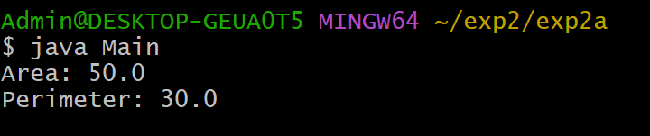
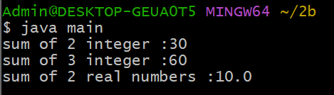

# EXPERIMENT-2
## 2a) Title: Find Area and Perimeter of a Rectangle
## Source Code:
```java
 public class Rectangle {
    double length;
    double breadth;

    double area() {
        return length * breadth;
    }

    double perimeter() {
        return 2 * (length + breadth);
    }
}
 class Main {
    public static void main(String[] args) {


        Rectangle rect = new Rectangle();

        rect.length = 10;
        rect.breadth = 5;

        double area = rect.area();
        double perimeter = rect.perimeter();

        System.out.println("Area: " + area);
        System.out.println("Perimeter: " + perimeter);
    }
}
```
## Output:


## 2b) Title: To implement method overloading
## Source Code:
```java
class Sum {

    int sum(int a, int b) {
        return a + b;
    }

    int sum(int a, int b, int c) {
        return a + b + c;
    }

     double sum(double a, double b) {
        return a + b;
    }
}
class main {
    public static void main(String[] args) {
        Sum s=new Sum();
        System.out.println("sum of 2 integer :"+s.sum(10, 20));
        System.out.println("sum of 3 integer :"+s.sum(10, 20, 30));
        System.out.println("sum of 2 real numbers :"+s.sum(5.5, 4.5));
    }
}
```
## Output:


## 2c) Title: To implement constructor
## Source Code:
```java
class Student {
    String sname;
    int sage;
    double smarks;
    Student (String name,int age,double marks) {
       sname=name;
       sage=age;
       smarks=marks;
    }
      void display() {
      System.out.println("student name:" + sname);
      System.out.println("student age:" + sage);
      System.out.println("stdent marks:" + smarks);
     }
  }
class main {
    public static void main(String args[]) {
       Student s=new Student("Supriya",20,789);
       s.display();
      }
}
```
## Output:

